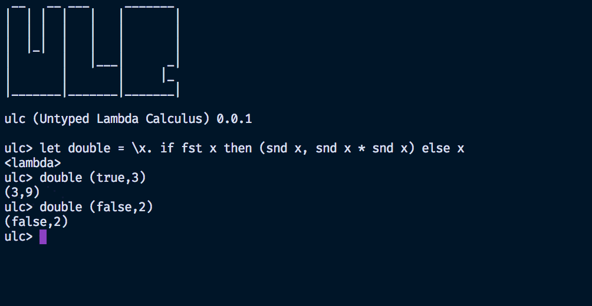

<h3>Untyped Lambda Calculus</h3>

ULC is a small functional programming language/interpreter and compiler(wip will compile to SKI combinators). The syntax, structure and semantics are similar to [styla](https://github.com/archanpatkar/styla) but ULC adds `let` bindings and `pairs` and removes typing.

## Install
Clone the repo and `cd` into the repo folder and then execute -
#### `npm install -g`
After it successfully installs then type(to open the **REPL**) -
#### `ulc`

## REPL

